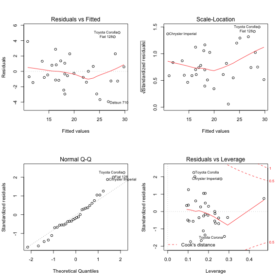

### Executive Summary
The objective of this analysis is to compare the miles per garlon (MPG) performance of motors with different transmission type (automatic and mannual). In details, this report reveals which type of transmission is better to cars' MPG performance and how much differences between them. Meanwhile, other factors would also be considered during the analysis. The regression analysis will be implemented in this study to find the relationships between MPG and other various cars' factors.

---

### Exploratory Analysis


```r
data(mtcars)
names(mtcars) <- c('MPG','Cylinders','Displacement','Horsepower','RearRatio','Weight','MileTime','VS','Transmission','Gear','Carburetors')
mtcars[which(mtcars$Transmission==1),9] <- 'manual'
mtcars[which(mtcars$Transmission==0),9] <- 'automatic'
mtcars$Cylinders <- as.factor(mtcars$Cylinders)
mtcars$VS <- as.factor(mtcars$VS)
mtcars$Transmission <- as.factor(mtcars$Transmission)
mtcars$Gear <- as.factor(mtcars$Gear)
mtcars$Carburetors <- as.factor(mtcars$Carburetors)
par(mfcol = c(1,2))
plot(density(mtcars$MPG)$x,density(mtcars$MPG)$y, xlab="MPG",ylab=NA)
boxplot(MPG~Transmission, data=mtcars, xlab='Transmission Type',ylab='Miles Per Gallon')
```


The first diagram above shows that the MPG of motors in train datasets follows normal distribution well which is good for regression analysis. The second diagram reveals a breif description regarding MPG by different transmission types. We can see from the plot that manual motors consume less fuels than automatic motors because both the mean and spred of MPG of manual cars are higher than that of cars with automatic transmission.

---

### Model Selection

The model uses both stepwise search to select the most important variables of model. All the factors are included in this model. Following is the details of the final model selected under stepwise method.


```r
fit1 <- lm(MPG~., data=mtcars)
fit2 <- step(fit1,direction='both', k=2, trace=0)
fit2$coef
```

```
##        (Intercept)         Cylinders6         Cylinders8 
##           33.70832           -3.03134           -2.16368 
##         Horsepower             Weight Transmissionmanual 
##           -0.03211           -2.49683            1.80921
```

We can see that a significant part of variables are removed and the remaining factors are important. We can also see that the transmission type has been selected in the model.

We also test the model with only transmission as independent variable and compare it with the previous two models. Following are the results of comparison.


```r
fit3 <- lm(MPG~Transmission, data=mtcars)
anova(fit3,fit2,fit1)
```

```
## Analysis of Variance Table
## 
## Model 1: MPG ~ Transmission
## Model 2: MPG ~ Cylinders + Horsepower + Weight + Transmission
## Model 3: MPG ~ Cylinders + Displacement + Horsepower + RearRatio + Weight + 
##     MileTime + VS + Transmission + Gear + Carburetors
##   Res.Df RSS Df Sum of Sq     F  Pr(>F)    
## 1     30 721                               
## 2     26 151  4       570 17.75 1.5e-05 ***
## 3     15 120 11        31  0.35    0.96    
## ---
## Signif. codes:  0 '***' 0.001 '**' 0.01 '*' 0.05 '.' 0.1 ' ' 1
```

From the results above, from model 3 to model 2, it has a P-value of 1.476e-05 which means it is worthy to accept model 2 while the P-value of model three is much larger than 0.05, so there is not much diffences to add extra variables in model 3. Lastly, we select model 2 as our final model.

---

### Interpret Coefficient

Here we are going to interpret the coefficients of our final model. The details of the model have been displayed below.


```r
summary(fit2)
```

```
## 
## Call:
## lm(formula = MPG ~ Cylinders + Horsepower + Weight + Transmission, 
##     data = mtcars)
## 
## Residuals:
##    Min     1Q Median     3Q    Max 
## -3.939 -1.256 -0.401  1.125  5.051 
## 
## Coefficients:
##                    Estimate Std. Error t value Pr(>|t|)    
## (Intercept)         33.7083     2.6049   12.94  7.7e-13 ***
## Cylinders6          -3.0313     1.4073   -2.15   0.0407 *  
## Cylinders8          -2.1637     2.2843   -0.95   0.3523    
## Horsepower          -0.0321     0.0137   -2.35   0.0269 *  
## Weight              -2.4968     0.8856   -2.82   0.0091 ** 
## Transmissionmanual   1.8092     1.3963    1.30   0.2065    
## ---
## Signif. codes:  0 '***' 0.001 '**' 0.01 '*' 0.05 '.' 0.1 ' ' 1
## 
## Residual standard error: 2.41 on 26 degrees of freedom
## Multiple R-squared:  0.866,	Adjusted R-squared:  0.84 
## F-statistic: 33.6 on 5 and 26 DF,  p-value: 1.51e-10
```

Based on the model summary above, we can see the R-squared is 0.8659 which means that there are arount 86.6% of variance have been explained by the model and the p-value of the model is 1.506e-10 which indicates the model is important enough. 

To be more specific, let's focus on the transmission variable of the model which is the major question we need to answer in this report.

Model 3 tells us that regardless all other factors, manual motor seem to run 7.245 miles higher per gallon than automatic motor does. While considering other significant factors, from our final model 2, the coefficient for transmissionmanual is around 1.81. So, the model tells us that basically a car with manual transmission performs 1.81 MPG higher than that of a car with automatic transmission.

Other coefficients can also tell us that with the increase of cylinder number, horsepower and weight, the mpg performance will decrease to various extent.

---

### Diagonosis (Residual)


```r
par(mfcol=c(2,2))
plot(fit2)
```



To do the diagonosis of model, we generated four plot above which are Residual vs Fitted plot, Scale-Location plot, Normal QQ plot and Residual vs Leverage plot. 

From the Residual vs Fitted plot, we can see the redisuals are allocated around a straight line. So we can confirm the linearity between MPG and other variables in this model. However, we also cannot deny the possibilities of unlinearity because the line is not perfectly straight in the plot.

The normal QQ plot also indicates the well linearity of the model. Due to the points are more or less on the line.

---

### Uncertanty Inference

However, we also need to point out the uncertanty of this model. 


```r
str(mtcars)
```

```
## 'data.frame':	32 obs. of  11 variables:
##  $ MPG         : num  21 21 22.8 21.4 18.7 18.1 14.3 24.4 22.8 19.2 ...
##  $ Cylinders   : Factor w/ 3 levels "4","6","8": 2 2 1 2 3 2 3 1 1 2 ...
##  $ Displacement: num  160 160 108 258 360 ...
##  $ Horsepower  : num  110 110 93 110 175 105 245 62 95 123 ...
##  $ RearRatio   : num  3.9 3.9 3.85 3.08 3.15 2.76 3.21 3.69 3.92 3.92 ...
##  $ Weight      : num  2.62 2.88 2.32 3.21 3.44 ...
##  $ MileTime    : num  16.5 17 18.6 19.4 17 ...
##  $ VS          : Factor w/ 2 levels "0","1": 1 1 2 2 1 2 1 2 2 2 ...
##  $ Transmission: Factor w/ 2 levels "automatic","manual": 2 2 2 1 1 1 1 1 1 1 ...
##  $ Gear        : Factor w/ 3 levels "3","4","5": 2 2 2 1 1 1 1 2 2 2 ...
##  $ Carburetors : Factor w/ 6 levels "1","2","3","4",..: 4 4 1 1 2 1 4 2 2 4 ...
```

According to the above summary, we can see that the training datasets for this regression analysis are really small, which has only 32 observations. It means the further statistical inference based on the existing datasets are highly possible to be biased. Because the number of observations of each variable is to small to say they are normal distributed and linear related to dependent variable.

---

### Conclusion

Overall, the regression analysis above can fairly tackle the problems from motor trend. The model indicates that cars with manual transmission always perform better on MPG performance. On average, manual cars can run around 1.8 more miles per gallon than automatic cars. Meanwhile, it has been proved that other factors like cylinders, horsepower and weight 
seem to have negative impacts on MPG performance. 

---

##### Thank you for your time!
##### Tianxiang Liu
